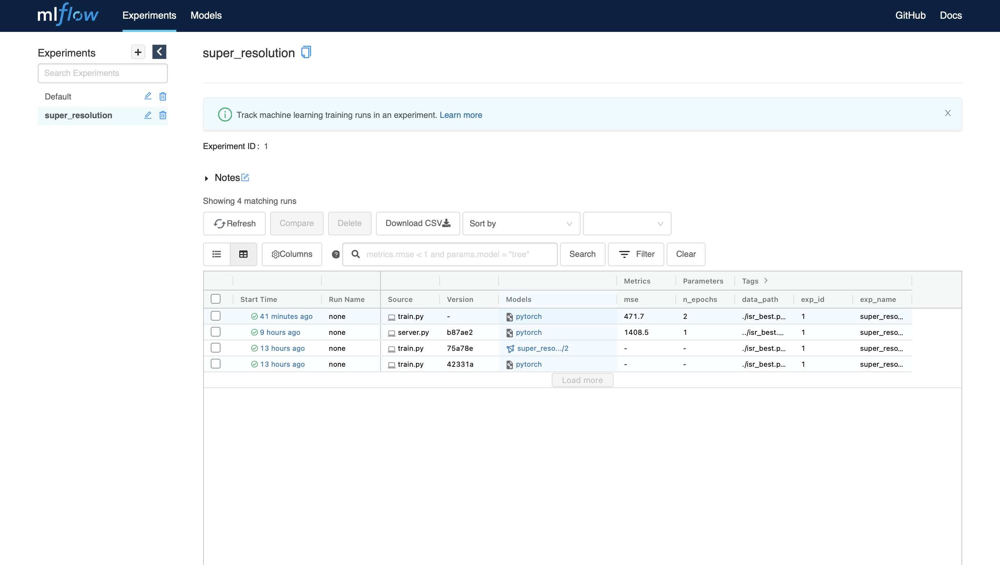

# Dockerized Model with MLflow and Flask web-server

## Overview
* Example of train and score a MLflow project with Flask web-app for super resolution.
* This work done as a Final Project for HSE course.
* Train Dataset: [STL-10](https://ai.stanford.edu/~acoates/stl10/) for training


## Training

### 1. Run MLFlow server
```
mlflow server \
    --backend-store-uri sqlite:///mlflow.db \
    --default-artifact-root ./artifacts \
    --host 0.0.0.0
```

### 2. Run experiments
```
python train.py --experiment_name super_resolution \
  --c 5.2 --max_iter 100
```
Or could use MLProject for run experiment like this:
```
mlflow run . \
  -P c=5.2 \
  -P max-iter=100 \
  -P experiment-name=super_resolution
```
Then we can check our experiments in MLflow UI


For every experiments calculates `MSE` for each model input params.

### 3. Register the model
Find the best run and register it as production version of model ```models:/super_resolution/production```:
```
python register_model.py --experiment_name super_resolution \
  --model_name super_resolution
```
Best experiment — experiment witch has minimal `MSE`:
```
runs = client.search_runs(exp.experiment_id, order_by=["metrics.mse ASC"], max_results=1)
```


### 4. Build Docker Container
```
mlflow models build-docker \
  --model-uri models:/super_resolution/production \
  --name dk-super-res
```

### 5. Run web-server with FLask
Server will run on `localhost:8000`
```
pythob server/server.py
```
And check example of web app
```

